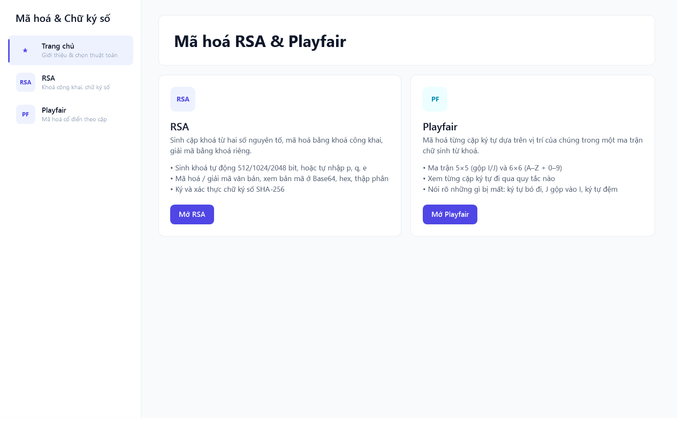
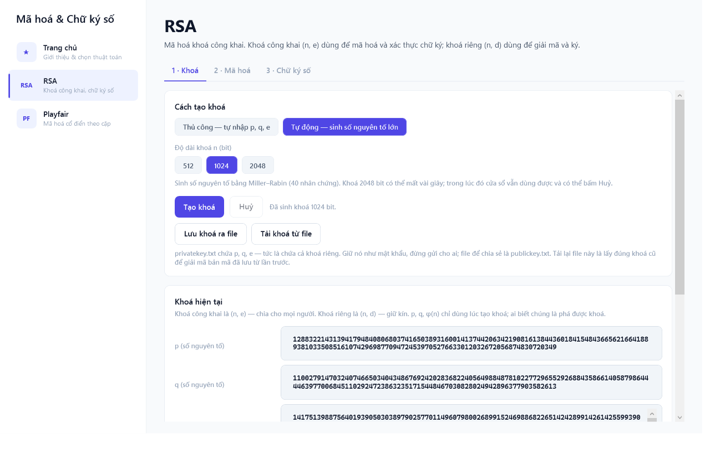
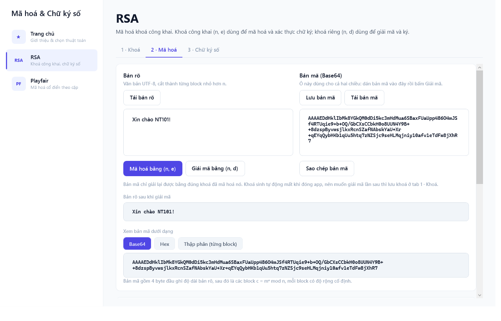
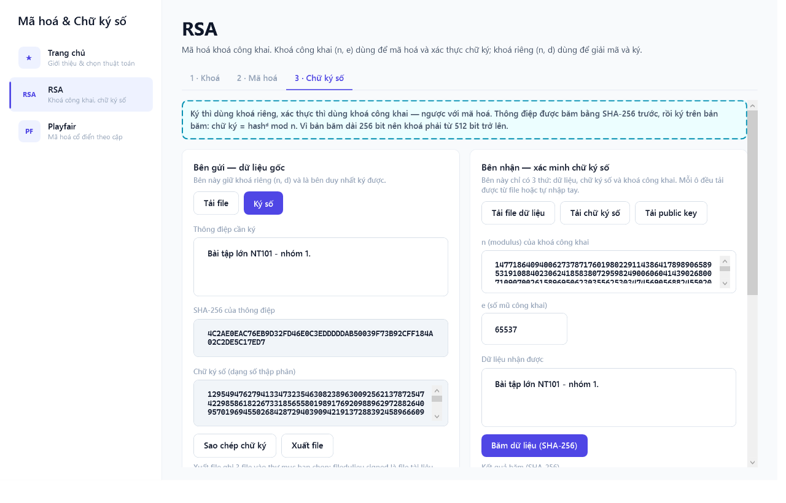
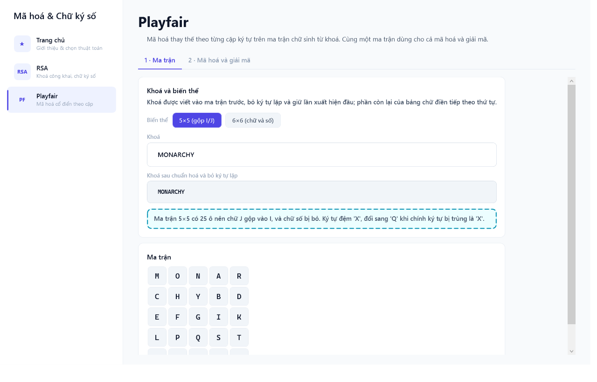
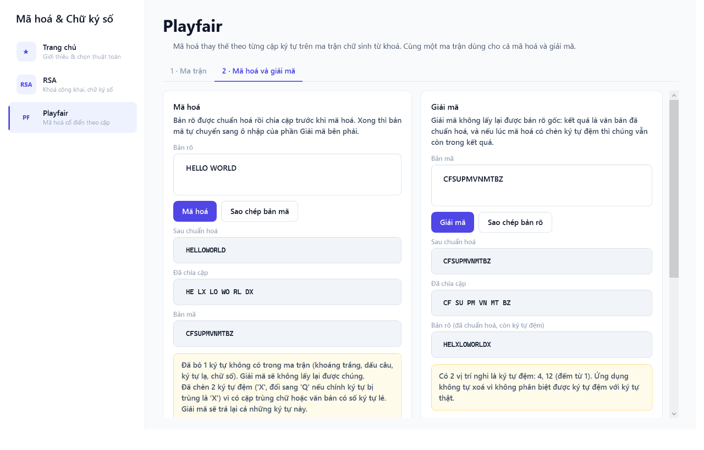

# RSA & Playfair

App desktop Windows minh hoạ hai thuật toán mã hoá: **RSA** (hiện đại, khoá công khai) và
**Playfair** (cổ điển, mã hoá theo cặp ký tự).

Phần lớn bản minh hoạ hai thuật toán này chỉ hiện input và output, nên người xem không thấy được
con số ở giữa đến từ đâu, và cũng không thấy được thuật toán yếu ở chỗ nào. App này hiện **từng
bước biến đổi**, và nói thẳng những giới hạn của thuật toán thay vì che.



## Chạy thử

Cần .NET 10 SDK trên Windows (app dùng WPF).

```bash
dotnet run
```

Không cần cài gì thêm — không có dependency NuGet nào cho app, không có thư viện crypto ngoài
`SHA256` và `RandomNumberGenerator` của .NET.

## RSA

### 1. Sinh khoá

Chọn **Auto** (512 / 1024 / 2048 bit) hoặc **Manual** (`p`, `q`, `e` — mặc định 61, 53, 17, bộ số
nhỏ kinh điển, dễ soi từng bước). Auto chạy async, có progress và huỷ được vì 2048 bit mất 5–20
giây.

Sáu ô giá trị hiện đủ `p`, `q`, `n`, `φ(n)`, `e`, `d` — không có con số nào bị ẩn.



### 2. Mã hoá / giải mã

Văn bản → UTF-8 bytes → cắt thành block nhỏ hơn `n` → `c = mᵉ mod n` từng block. Bảng vết hiện
từng block, và chọn một block thì thấy luôn **từng bước square-and-multiply** của phép luỹ thừa
modulo đó.



Container bản mã tự định nghĩa, xuất ra Base64:

```
[4 byte độ dài bản rõ, big-endian][block bản mã, mỗi block cố định CipherBlockBytes byte]
```

4 byte header giữ độ dài thật nên block cuối không cần padding. Ô "xem bản mã dưới dạng" đổi được
Base64 / hex / thập phân, nhưng **chỉ Base64 giải mã lại được** — hai dạng kia là để xem.

### 3. Chữ ký số

Tab này chia **hai cột cố ý**: cột trái là bên gửi (có khoá riêng), cột phải là bên nhận
(**chỉ có** tài liệu, chữ ký và khoá công khai).

Cột phải không đọc khoá đang có trong bộ nhớ, kể cả khi khoá đó đang nằm ngay ở tab 1. Nó chỉ đọc
`n`, `e` từ ô nhập hoặc từ `publickey.txt`. Nếu nó đọc khoá trong bộ nhớ thì demo chỉ chứng minh
được "một máy ký rồi tự kiểm lại chính mình" — không phải chuyện mà chữ ký số giải quyết.



Bên gửi: `SHA-256(thông điệp)` → `s = Hᵈ mod n`. Bên nhận: băm lại dữ liệu nhận được, lấy
`H′ = sᵉ mod n`, rồi so `H` với `H′`. Ba bước bấm riêng được để thấy từng bước, nhưng phán quyết
hợp lệ/không vẫn do `Core.RsaSignature.Verify` đưa ra — nó so trên số nguyên, không so hai chuỗi
hex đang hiện trên màn hình.

Ba file trao đổi: `filedulieu.signed` (tài liệu, UTF-8 không BOM), `chukyso.txt` (chữ ký, số thập
phân), `publickey.txt` (`n` và `e` có nhãn). Khoá riêng **không bao giờ** nằm trong ba file đó.

Muốn thấy xác minh thất bại: sửa một ký tự ở ô dữ liệu bên phải → kết quả băm bị xoá → băm lại →
xác minh → KHÔNG HỢP LỆ.

## Playfair

### 1. Ma trận

Khoá sinh ra ma trận 5×5 (gộp I/J) hoặc 6×6 (thêm chữ số). Đổi khoá hoặc đổi biến thể là dựng lại
ma trận và **xoá kết quả cũ**, vì kết quả cũ tính bằng ma trận cũ.



### 2. Mã hoá và giải mã

Tab chia **hai làn cạnh nhau**: mã hoá bên trái, giải mã bên phải. Mã hoá xong thì bản mã tự sang
ô nhập của làn giải mã, nên vòng mã hoá → giải mã không cần nút chuyển tay nào. Lỗi cũng theo làn:
bản mã lẻ ký tự chỉ làm đỏ làn giải mã.

Bảng vết dùng chung một bảng cho hai làn — nó chỉ có nghĩa khi đặt cạnh ma trận sinh ra nó, mà ma
trận của hai chiều là một. Chọn một cặp thì các ô của cặp đó **sáng lên trên ma trận**, kèm câu
giải thích quy tắc nào đã áp dụng.



Giải mã **không** lấy lại được bản rõ gốc, chỉ lấy lại được văn bản đã chuẩn hoá và đã đệm
(`HELLO` → `CFSUPM` → `HELXLO`). App nói thẳng phần mất đó ở băng cảnh báo (đã bỏ bao nhiêu ký tự,
đã gộp I/J, đã chèn bao nhiêu ký tự đệm) và chỉ **phỏng đoán** vị trí ký tự đệm — không có cách
nào phân biệt chữ `X` thật với chữ `X` do máy chèn, nên app không xoá hộ.

## Kiến trúc

```
Core/                 Toán học thuần. Không tham chiếu WPF. Đây là ràng buộc cứng.
Core/Key_Generation/  Sinh nguyên tố, dẫn xuất khoá, lưu/tải file khoá.
Core/Rsa/             Hai phép RSA (mã hoá, chữ ký) và các record dùng chung.
Core/Playfair/        Ma trận chữ, chia cặp, ba quy tắc, vết từng cặp.
UI/Common/            Hạ tầng MVVM + thứ phụ thuộc WPF (hộp thoại file, converter).
UI/ViewModels/        Trạng thái và lệnh của từng màn hình.
UI/Views/             XAML.
UI/Theme/             Design system tự viết (Palette.xaml, Controls.xaml).
```

`Core/` phải sạch WPF vì phần đáng soi nhất là toán học: tách ra thì test được bằng xUnit mà không
cần dựng cửa sổ. `Microsoft.Win32.OpenFileDialog`, `Clipboard`, `MessageBox` vì vậy nằm ở
`UI/Common/TextFileDialogs.cs`.

MVVM đầy đủ (`ViewModelBase`, `RelayCommand` / `AsyncRelayCommand`), không code-behind nào chứa
logic. Điều hướng không có navigation service: `MainViewModel` giữ danh sách `NavItem`, vùng nội
dung bind thẳng vào `SelectedNav.Content`.

## Đọc thêm

`PROJECT_CONTEXT.md` đi sâu vào phần README này cố ý không nói: vì sao mỗi quyết định kỹ thuật được
chọn và đánh đổi cái gì (textbook RSA không padding, `φ(n)` thay `λ(n)`, header 4 byte thay padding,
Playfair chèn ký tự đệm trong lúc chia cặp), các bẫy đã xử lý, và chiến lược test.
`CHANGELOG.md` ghi lịch sử thay đổi theo ngày.
